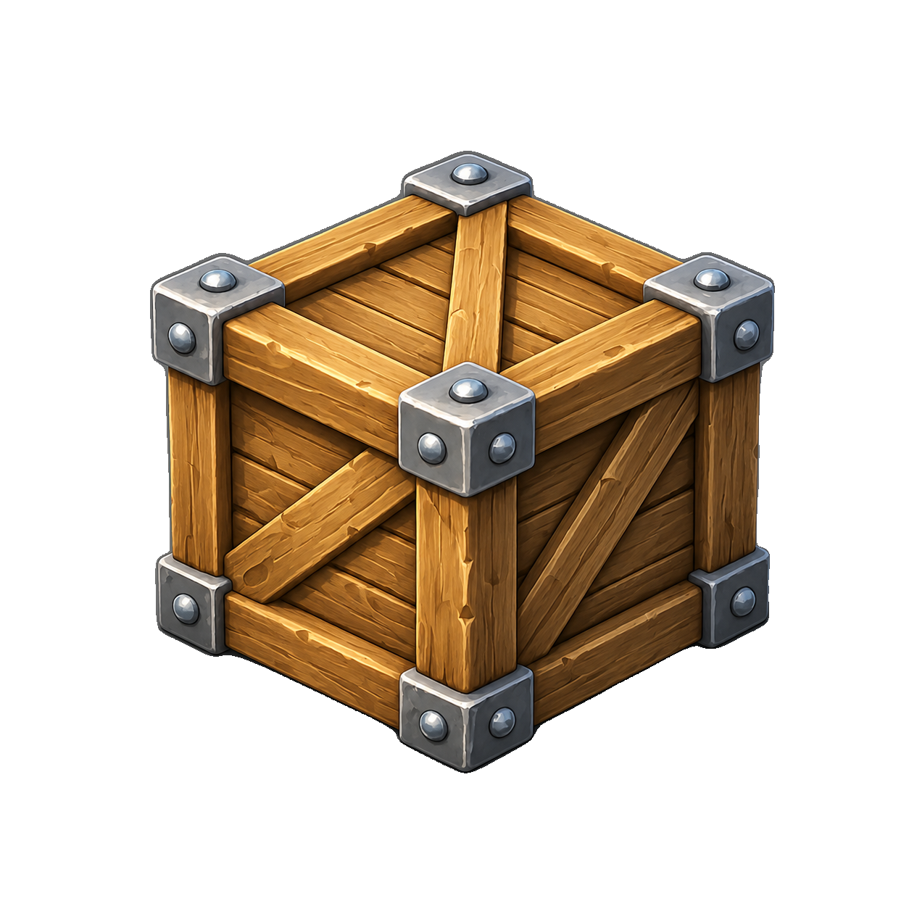

# SAM 3D Objects — Apple Silicon (macOS / MPS) port

Run Meta's **[SAM 3D Objects](https://github.com/facebookresearch/sam-3d-objects)**
image → 3D pipeline on an Apple Silicon Mac. Give it a photo, get back a gaussian
splat and a **textured `.glb` mesh** — no CUDA, no NVIDIA GPU.

The upstream model is CUDA-only. This fork replaces every CUDA-specific piece
(spconv, gsplat, nvdiffrast, float64 kernels) with pure-PyTorch / MPS-friendly
equivalents so the whole thing runs on the Mac's unified-memory GPU. See
[PORT_LOG.md](PORT_LOG.md) for the full list of changes, and
[README.upstream.md](README.upstream.md) for Meta's original README.

> ⚠️ This is an unofficial community port. The model, weights and the
> **SAM License** ([LICENSE](LICENSE)) belong to Meta. Your use of the weights
> is governed by that license — this repository only adds macOS glue code.

---

## Requirements

- **Apple Silicon** Mac (M1/M2/M3/M4). Tested on a Mac with ~24–30 GB unified memory.
- **macOS** with a recent PyTorch that has MPS enabled.
- **~12 GB** free disk for the model weights + working memory headroom.
- Python 3.11.

Memory is the main constraint: the pipeline is memory-heavy and runs **one stage
at a time** on purpose (see *How it works*). Quit other GPU-hungry apps (browsers,
Ollama, etc.) before a run — memory pressure is the usual cause of a failed
(all-NaN) result.

---

## Install

### Easiest: guided setup (recommended for non-technical users)

```bash
./setup.sh
```

`setup.sh` walks you through the whole thing — it checks/installs Python, creates
the environment, installs the packages, opens the Hugging Face pages you need,
logs you in, and downloads the model weights. When it finishes, just run
`./run.sh`. (Your Hugging Face token is entered into Hugging Face's own tool and
is never stored in this project.)

Prefer to do it by hand? Follow the manual steps below.

### Manual install

```bash
# 1. Create a Python 3.11 virtual environment next to the repo
python3.11 -m venv ../s3d_env
source ../s3d_env/bin/activate

# 2. Install PyTorch (MPS build) + dependencies
pip install --upgrade pip
pip install torch torchvision torchaudio          # arm64 / MPS build
pip install -r requirements.txt
pip install -e .

# 3. rembg (background removal) + trimesh/xatlas etc. are in requirements.txt
```

`run.sh` expects the venv at `../s3d_env` (sibling of this repo). If yours lives
elsewhere, it falls back to whatever `python3` is on your `PATH`.

Key packages: `torch` (MPS), `hydra-core`, `omegaconf`, `trimesh`, `pymeshfix`,
`xatlas`, `pyvista`, `rembg`, `moge`, `utils3d`, `gradio`.

---

## Getting the model weights

The weights (~12 GB) are **not** in this repo. `./run.sh` will detect if they're
missing and print these steps. Download them once:

1. **Request access** (one-time) on Hugging Face:
   <https://huggingface.co/facebook/sam-3d-objects>

2. **Authenticate:**
   ```bash
   pip install 'huggingface-hub[cli]<1.0'
   hf auth login          # paste a token from https://hf.co/settings/tokens
   ```

3. **Download into the repo:**
   ```bash
   mkdir -p checkpoints/hf
   hf download --repo-type model --max-workers 1 \
     --local-dir checkpoints/hf-download \
     facebook/sam-3d-objects
   mv checkpoints/hf-download/checkpoints checkpoints/hf/checkpoints
   rm -rf checkpoints/hf-download
   ```

When done, this directory must exist and hold the `.ckpt` / `.yaml` files:

```
checkpoints/hf/checkpoints/
├── pipeline.yaml
├── ss_generator.ckpt        (~6.2 GB)
├── slat_generator.ckpt      (~4.6 GB)
├── ss_decoder.ckpt
├── slat_decoder_gs.ckpt
├── slat_decoder_mesh.ckpt
└── … (matching .yaml configs)
```

---

## Usage

```bash
./run.sh
```

That's the whole thing. It asks for the source image(s), output folder, quality,
and GLB output mode, then runs end to end:

1. **Images** — choose either a single ordinary photo or multiple views of the
   same object. The first view is the primary geometry/depth view; the other
   views are extra conditioning references. The background is removed
   automatically (rembg); you do **not** need to pre-extract the object.
2. **Output folder name** — results are written to `outputs/<name>/`.
3. **Quality** — diffusion steps for both stages:
   `Low = 10` (default), `Medium = 25`, `High = 50`, or a custom value.
4. **GLB output** — choose the generated mesh export:
   `Game` (default), `Unoptimised`, `Both`, or `Experimental`.
5. **Mesh settings** — shown for `Game`, `Both`, or `Experimental`: target
   triangle budget.

Output in `outputs/<name>/`:

| File            | What it is                                             |
|-----------------|--------------------------------------------------------|
| `extracted.png` | the object with background removed (RGBA)              |
| `extracted_view_02.png`, ... | optional extracted reference views        |
| `input_views.txt` | optional manifest of the supplied view paths          |
| `splat.ply`     | the raw gaussian splat                                 |
| `slat.pt`       | the sparse latent (input to the mesh decoder)          |
| `mesh_game.glb` | optional/default game-oriented low-poly textured mesh  |
| `mesh.glb`      | optional unoptimised high-detail textured mesh         |
| `mesh_experimental.glb` | optional experimental textured runtime mesh    |
| `mesh_experimental_quads.obj` | editable quad-dominant experimental mesh |
| `mesh_experimental_report.json` | topology and surface-error measurements |

Multiple views are experimental and memory-sensitive. View 1 drives depth and
pose; all supplied views are averaged into the Stage 1 and Stage 2 condition
embeddings before generation. Extra views are streamed through the condition
embedders one at a time to avoid a batch-size memory spike, but they still add
depth and conditioning work, so 2-4 views is the practical range on a 24 GB Mac.

The `Game` export builds a quality-safe welded mesh before UV unwrap and texture
baking, so the texture is baked directly onto the exported game asset. The face
target is treated as a quality hint, not a hard destructive cap: the exporter may
keep more faces when a low target would damage the silhouette or texture bake.
Moderate decoded meshes are pre-cleaned before the game reduction, then close
seams and near-surface fragments are welded into the main mesh on CPU before
baking. The final game mesh is forced to a single connected body; only unresolved
leftovers are discarded after the weld attempt. A final sliver pass collapses
extreme skinny triangles at tips before UV unwrap and texture baking. Long,
thin props such as spears can keep extra subdivisions when the requested target
would leave visibly stretched faces. Very large decoded meshes skip the
pre-clean step to avoid the MPS-heavy cleanup that can crash on million-face
assets.
`Both` creates `mesh_game.glb` first and then `mesh.glb` for side-by-side
comparison.

The separate `Experimental` export does not use the game remesher. It rebuilds
the surface with an in-repo signed-distance and QEF dual-contouring implementation:

1. align a bounded grid to the source object's principal frame;
2. fit one feature-aware vertex per intersected cell;
3. connect those cells into a regular quad-dominant surface;
4. relax vertices tangentially and project them back to the untouched source;
5. repair ambiguous local patches and reject boundary or non-manifold results;
6. measure bidirectional surface error and raise the grid resolution when the
   requested budget loses too much shape.

No external retopology executable or service is used. The OBJ preserves editable
quads; the GLB is triangulated for runtime compatibility and receives its texture
after the experimental topology has been finalized. A small number of local
repair triangles may appear where multiple source sheets meet inside one grid
cell; their counts are recorded in the JSON report.

GLB files are runtime meshes and are stored as triangles. Targets below 500
faces are rejected to avoid accidentally destroying silhouettes.

**Re-bake the mesh only** (skips the expensive splat step) from an existing
`splat.ply` + `slat.pt`:

```bash
./run.sh glb outputs/<name>
```

**Create only the game mesh** from an existing result folder:

```bash
./run.sh game outputs/<name> 2000
```

Use `auto` instead of a number to pick a target automatically.

**Create only the separate experimental mesh** from an existing result folder:

```bash
./run.sh experimental outputs/<name> 2000
```

The face value is the initial runtime-triangle budget. The quality gate may use
more faces when necessary. Its main limits can be adjusted without changing code:

| Variable | Default | Purpose |
|----------|--------:|---------|
| `SAM3D_EXPERIMENTAL_ERROR_P95` | `0.015` | allowed p95 surface error as a fraction of object bounds |
| `SAM3D_EXPERIMENTAL_MAX_TARGET_MULT` | `4` | maximum automatic budget increase |
| `SAM3D_EXPERIMENTAL_MAX_FACES` | `40000` | hard automatic face ceiling |
| `SAM3D_EXPERIMENTAL_MAX_AXIS` | `144` | largest signed-distance grid dimension |
| `SAM3D_EXPERIMENTAL_QUALITY_ATTEMPTS` | `2` | reconstruction attempts before acceptance |
| `SAM3D_EXPERIMENTAL_MIN_THICKNESS_CELLS` | `16` | minimum grid resolution across open-mesh thickness |
| `SAM3D_EXPERIMENTAL_SHELL_BAND` | `0.55` | unsigned shell width in grid-cell units |

---

## Example results

Generated crate sample:

<p>
  
</p>

| Result | Face budget | File |
|--------|------------:|------|
| Game mesh | target 2,000 | [`outputs/crate/mesh_game.glb`](outputs/crate/mesh_game.glb) |
| Unoptimised mesh | 14,994 | [`outputs/crate/mesh.glb`](outputs/crate/mesh.glb) |

Open either `.glb` link on GitHub to use its built-in rotatable 3D viewer.

---

## Performance & memory  ⚠️

A full run takes roughly **40–80 minutes** depending on the quality you pick.

**If you have 24 GB of unified memory, use Low (10 steps) only.** Medium/High
need more headroom and will typically crash a 24 GB Mac (out-of-memory →
all-NaN result or an `Abort trap: 6`).

More steps buy you very little. Going from 10 → 50 steps produced only about
**3% more vertices and 5% more faces** in testing — while Stage 1 alone gets much
slower:

| Quality      | Steps | Stage-1 time (avg) | Geometry vs. Low |
|--------------|-------|--------------------|------------------|
| **Low**      | 10    | ~10 min            | baseline         |
| Medium       | 25    | ~24 min            | ≈ +a few %       |
| High         | 50    | ~45 min            | ~+3% verts / +5% faces |

The difference in the final mesh is minor; the main cost of higher steps is time
(and memory). Low is the recommended setting for almost everyone.

**Low-memory mode (automatic on MPS).** The splat step keeps the big diffusion
backbones in fp16 (instead of fp32, ~halving their RAM) and frees each stage's
models as soon as it's done — the depth model before Stage 1, the
sparse-structure model before Stage 2, the SLAT model before decoding. This
lowers the peak enough to run on smaller Macs; still use **Low (10 steps)** on
24 GB and close other apps first.

**Large-object mesh decode fallback.** If a generated object has a very large
`slat.pt`, the fp32 mesh decoder may still exceed MPS memory. GLB conversion now
automatically decodes large SLATs on CPU, frees the decoder, then loads gaussian
splats back on MPS for texture baking. This is slower but avoids the macOS
`killed` failure during `DECODING MESH`. Override with:

```bash
SAM3D_MESH_DECODE_DEVICE=mps ./run.sh game outputs/<name> 1600
SAM3D_CPU_DECODE_VOXELS=50000 ./run.sh game outputs/<name> 1600
```

---

## How it works

The run is split into **two separate OS processes** so that only one
memory-heavy stage is ever resident — macOS only reclaims a process's GPU memory
when it exits.

```
 ┌── Stage 1: cli.py ───────────────┐        ┌── Stage 2: ply2glb.py ───────┐
 │  photo → rembg mask              │        │  slat.pt → mesh decoder      │
 │  → sparse-structure diffusion    │  exit  │  → selected mesh generation  │
 │  → SLAT diffusion                │ ─────▶ │  → multi-view texture bake   │
 │  → gaussian splat  (splat.ply)   │ (frees │  → textured mesh.glb         │
 │  → sparse latent   (slat.pt)     │  mem)  │                              │
 └──────────────────────────────────┘        └──────────────────────────────┘
```

Between stages `run.sh` waits until enough memory is free before loading the mesh
decoder. Generation uses fp16 with a random seed in `0–41` (seed 42 was observed
to overflow to NaN under memory pressure); an all-NaN result is detected and
**not** written, so you never get a silently-dead `splat.ply`.

### What was ported from CUDA

- **`gsplat_silicon`** — pure-PyTorch EWA gaussian rasterizer replacing the
  CUDA-only `gsplat`.
- **`mesh_raster_silicon`** — tile-based z-buffered triangle rasterizer replacing
  `nvdiffrast` for face-id / UV rasterization and hole filling.
- **native sparse conv** — pure-PyTorch drop-in for `spconv`.
- **float64 on CPU** — MPS has no float64; camera math and splat sort keys are
  computed on CPU and moved back to the device.
- **fp32 mesh decoder** — the mesh decoder's attention overflows in fp16 on MPS,
  so it is forced to fp32.

---

## Troubleshooting

- **`MODEL WEIGHTS NOT FOUND`** — download the weights (see above).
- **Output is NaN / crash mid-run** — memory pressure. Quit other GPU apps and
  re-run; each run is a fresh process, so retries start clean.
- **`Abort trap: 6` / MTLBuffer allocation failure** — not enough free memory for
  the model. Close apps and don't run two heavy jobs at once.

---

## Credits & License

- Original model, research and weights: **Meta / SAM 3D Team** —
  [facebookresearch/sam-3d-objects](https://github.com/facebookresearch/sam-3d-objects).
- Apple Silicon port: this repository.

Use of the model and weights is subject to Meta's **SAM License** — see
[LICENSE](LICENSE). This port is provided as-is for research/personal use under
those same terms.
